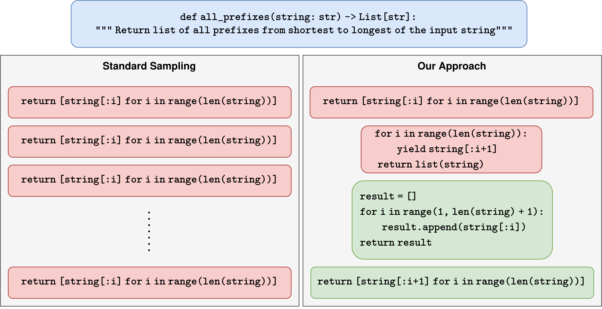
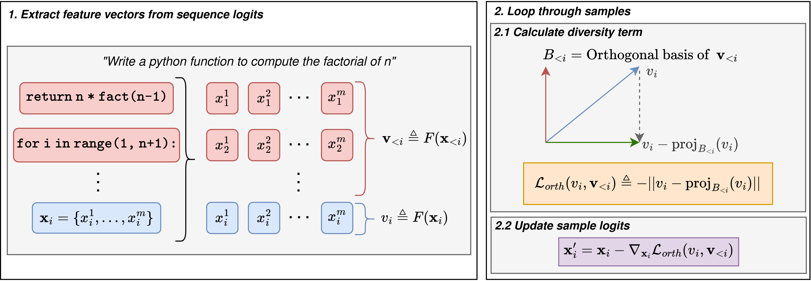

# ODD: Orthogonal Diverse Diffusion
**Official Repository for the paper "Free Lunch for Pass@k? Low Cost Diverse Sampling for Diffusion Language Models".**

## Overview

This repository contains the official implementation of **ODD (Orthogonal Diverse Diffusion)**, a training-free inference strategy designed to enhance the diversity and sample efficiency of Diffusion Language Models (such as LLaDA). 

By applying a lightweight, geometric repulsion term during the denoising process, ODD forces the model to explore distinct reasoning paths within a single batch, significantly improving **Pass@k** performance on reasoning and coding benchmarks like GSM8K and HumanEval with negligible computational overhead.

## Approach

Unlike standard sampling, which treats every generation independently and often collapses into redundant modes, ODD exploits the intermediate states of the diffusion process. For each sample in a batch, it projects the latent features away from the subspace spanned by previous samples, enforcing structural diversity without requiring retraining or complex beam searches.

## Repository Structure

The codebase is structured as follows:

### Core Logic
* **`odd_core.py`**: The main logic of our approach.
    * `FeatureExtractor`: Extracts features from model logits during diffusion. Baseline is max-pool over logits, however alternative feature extraction methods could improve performance. 
    * **Strategy Implementations**:
        * `BatchedOrthogonalProjectionStrategy`: The main **ODD** algorithm. Sequentially projects samples away from the history of the batch.
        * `JointStrategy`: The **DiverseFlow** baseline (DPP-based global optimisation).
        * `BaselineStrategy`: Standard independent sampling.
    * `DPPGenerator`: Manages the iterative diffusion loop, applying the selected strategy at each timestep.
* **`odd_gen.py`**: The primary entry point for single run text generation. It loads the model, configures the strategy via Hydra, and produces outputs for a given prompt.
* **`utils.py`**: Contains utility functions for evaluation, specifically `calculate_diversity_score` which uses `SentenceTransformer` to measure cosine similarity between generated outputs.

### Benchmarking & Evaluation
Run these scripts to replicate the experiments in the paper. They handle dataset loading, answer extraction, and Pass@k calculation, and log to Weights and Biases (WandB). Optuna is used to control and synchronize the sweeps in multi-node and multi-process setups, currently using a grid sweep for the paper results. This can easily be changed to e.g. TPESampler to find the best hyperparameters for a given setup more quickly. 
* **`sweep_gsm8k.py`**: Experiments for the 200 problem subset we test on in GSM8K, extracts answers by the final numeric value in the output string.
* **`sweep_human_eval.py`**: Evaluation over the HumanEval coding benchmark. It interfaces with the local `human_eval` directory to execute and validate generated code samples.

### Visualization & Analysis
* **`app.py`**: An interactive Streamlit application, which visualises the diffusion process in real time, plotting entropy and repulsion forces step-by-step to understand how various diversity approaches alter the generation trajectory.
* **`analyse_results/`**: Contains scripts to download WandB run data and generate the tables/plots found in the paper, as well as profiling the overhead. 
* **`conf/`**: Stores the Hydra configuration files.
* **`human_eval/`**: A fork of the official HumanEval evaluation harness, used by `sweep_human_eval.py` to run code execution tests.

## Installation