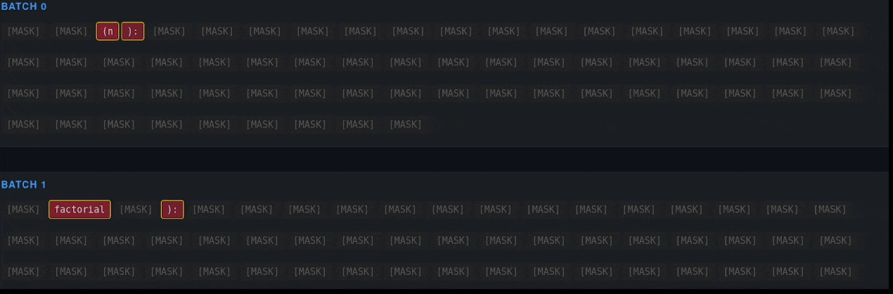

<h1 align="center">Free Lunch for Pass@k? Low Cost Diverse Sampling for Diffusion Language Models</h1>
<p align="center">
  <strong>Supplementary Code for NeurIPS26 Submission</strong>
</p>

---

## Overview
This repo contains all relevant code needed to replicate the results from the paper. Some key information to replicate results:

- For full transparency, we include the raw data from all of our experiments used to create the figures and tables in the paper.
    - For the main LLaDA results, these are in `analyse_results/`, and all figures/tables can be generated with `gen_results.sh`
    - For the Dream results, and LLaDA feature and step/length generalisation, see the `new_results/` directory. The figures can be generated with `gen_new_results.sh`.
- If you want to run experiments from scratch, the code is set up to use WandB to log experiment data, and then pull the data for analysis.
    - Uncomment the data/table download lines in the above scripts, and point the `download_{runs|data|tables}.py` scripts to your WandB entity
- Separate environments were used for Dream and LLaDA experiments, with installation instructions below

## Installation

For all LLaDA based experiments, install the base conda and pip requirements:

```bash
conda env create -f environment.yml
conda activate odd
pip install -r requirements.txt
```

*Note: Install `flash_attn` and `triton` separately if supported by your system, with the versions we use commented out in `requirements.txt`.*

*For Dream, we used a separate environment, which can be setup through `dream_env.sh`*

## Usage

Run `python odd_gen.py` to run a diversity augmented generation. The prompt and diversity settings can be configured in the config file `conf/config.yaml`.


## Repository Structure

The codebase is structured as follows:

### Experiment Run Scripts
Run these scripts to replicate the LLaDA experiments in the paper. They handle dataset loading, answer extraction, and Pass@k calculation, and log to Weights and Biases (WandB).
Optuna is used to control and synchronize the sweeps in multi-node and multi-process setups, currently using a grid sweep for the paper results.
This can easily be changed to e.g. TPESampler to find the best hyperparameters for a given setup more quickly.

* **`sweep_gsm8k.py`**: Experiments for LLaDA over the 200 problem subset we test on in GSM8K, extracts answers by the final numeric value in the output string.
* **`sweep_human_eval.py`**: Evaluation for LLaDA over the HumanEval coding benchmark. It interfaces with the local `human_eval` directory to execute and validate generated code samples.

To replicate the Dream experiments, feature ablation and length/step generalisation results:

* **`sweep_dream.py`**: Evaluation for Dream over HumanEval and GSM8K
* **`feature_ablation.py`**: Evaluation for LLaDA over different feature extractors.
* **`generalisation.py`**: Evaluation for LLaDA over different diffusion steps and generation length settings.

To run the profiling experiments, run `profile_model_.py`. By default, this runs the quantized model, you can remove the bnb conf to test bf16.
Ensure the filenames match what is used in `analyse_results/plot_overhead.py` to replicate the overhead figures.

### Core Logic
* **`feature_extractor.py`**: Contains the `FeatureExtractor`, which extracts features from model logits during diffusion. Baseline is max-pool over logits, however alternative feature extraction methods could improve performance.
* **`strategies.py`**: Contains the diversity strategy implementations:
    * `ODDStrategy`: The main **ODD** algorithm. Sequentially projects samples away from the history of the batch.
    * `DPPStrategy`: The **DiverseFlow** baseline (DPP-based global optimisation).
    * `BaselineStrategy`: Standard independent sampling.
* **`generator.py`**: Contains `DiverseGenerator`, which manages the iterative diffusion loop and applies the selected strategy at each timestep.
* **`app_generator.py`**: Contains `AppGenerator`, a specialised generator used exclusively by the Streamlit app to track counterfactuals and logging metrics.
* **`odd_gen.py`**: The primary entry point for single run text generation. It loads the model, configures the strategy via Hydra, and produces outputs for a given prompt.
* **`profile_model_.py`**: Profiling script to test performance overhead of our approach.
* **`utils.py`**: Utility functions.

### Visualisation & Analysis
* **`app.py`**: Interactive Streamlit application for local, real-time generation visualization.
* **`analyse_results/`**: Contains scripts to download WandB run data and generate the tables/plots found in the paper, as well as profiling the overhead.
* **`conf/`**: Stores the Hydra configuration files.
* **`human_eval/`**: A fork of the official HumanEval evaluation harness, used by `sweep_human_eval.py` to run code execution tests.
* **`new_results/`**: Scripts to download and analyse experiments from Dream and LLaDA feature/generalisation experiments.


## Interactive Visualisation

<p align="center">
  
</p>
<p align="center">
  <em>Interactive dashboard visualising ODD altering generation in real-time. It highlights counterfactuals, showing exactly what standard sampling would have unmasked (dashed) and where ODD forced a unique path (blue).</em>
</p>


To understand exactly how diversity interventions alter the model's generation trajectory, we provide an interactive visualisation tool.

### Local Generation
Run `streamlit run app.py` to launch the local Streamlit interface. This allows you to specify custom prompts and generation settings (alpha, temperature, batch size, etc.)